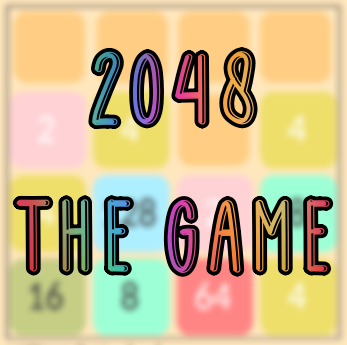

 # 2048 Game
 2048 Game is a Java Android game with some bonus functionalities such as Users, Undo movement
 among other functions.
 
 

## Features
- Save scores on local SQLite DB
- Sort by any camp (Score, username, country, duration, datetime...)
- Edit score
- User profiles with avatar and country
- Undo movement (With no penalization)
- Restart game
- Delete scores (With a click or a swipe)

 ## Tables
 ### Score Table
 A score has 5 columns:
 - Score_id -> Primary key
 - Score_value -> Value with the sum of user's combinations
 - Score_duration -> Game duration
 - Score_datetime -> Date the score was saved
 - Score_username_id -> Foreign key, references User_id

 ### User Table
 Separately, users have their own table and any change applied to a user is applied to all scores
 with same id.
 - User_id -> Primary key, connected to Score_username_id Foreign Key
 - User_name -> If it's changed, a new id is created with new username
 - User_country -> User's country. Can be defined through locale properties on "Edit Score"
 - User_avatar -> Path of stored avatar image

 ## License and references
 [Personal Website](https://www.codebinars.com)
 
 [MIT](https://choosealicense.com/licenses/mit/)